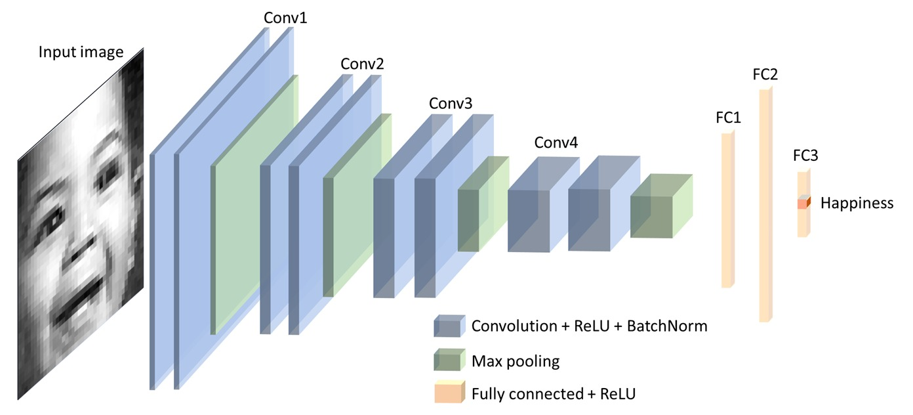
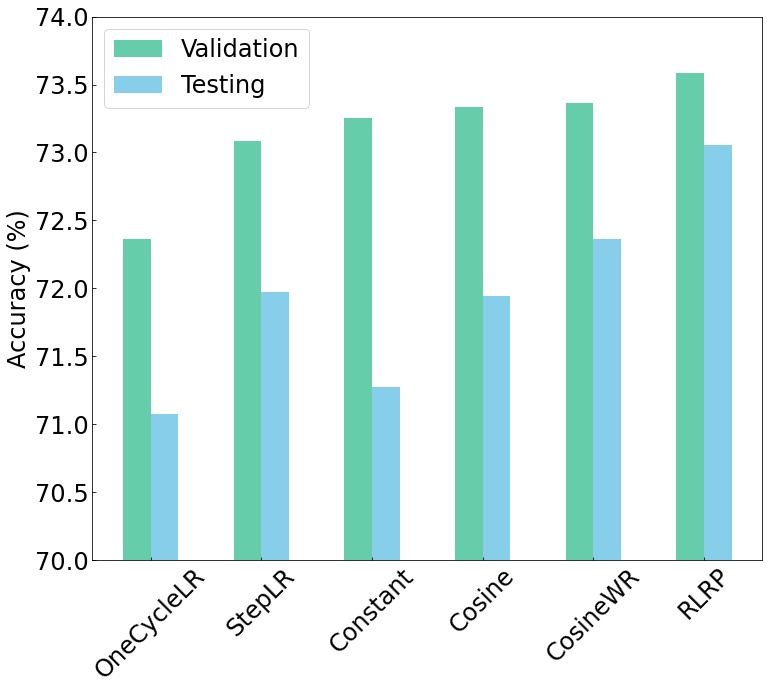

## Facial Emotion Recognition (FER)

This work is published on [arXiv](https://arxiv.org/abs/2105.03588)

### Overview
In this work, we achieve the highest single-network classification accuracy on FER2013. We adopt the VGGNet architecture, rigorously fine-tune its hyperparameters, and experiment with various optimization methods. To our best knowledge, our model achieves state-of-the-art single-network accuracy of 73.28 % on FER2013 without using extra training data.

### Architecture


### Tuning

In tuning, we experiment with several deifferent optimizers, learning schedulers and run a grid search over all parameters. Some of our results are shown below.

Optimizers            |  Schedulers
:-------------------------:|:-------------------------:
  |  

### Confusion Matrix


### Saliency Maps
Visualizing the information captured inside deep neural networks helps describe how they differentiate between different facial emotions. A saliency map is a common technique used in visualizing deep neural networks. By propagating the loss back to the pixel values, a saliency map can highlight the pixels which have the most impact on the loss value. It highlights the visual features the CNN cancapture from the input; thus, allowing us to better understand the  importance of each feature in the original image on the final classification decision.


### Installation
To use this repo, create a conda environment using `environment.yml` or `requirements.txt`

```
# from environment.yml (recommended)
conda env create -f environment.yml

# from requirements.txt
conda create --name <env> --file requirements.txt
```
Download the offical [fer2013](https://www.kaggle.com/c/challenges-in-representation-learning-facial-expression-recognition-challenge/data) dataset, and place it in the outmost folder with the following folder structure `datasets/fer2013/fer2013.csv`

### Usage

To train your own version of our network, run the following

```
python train.py network=vgg name=my_vgg
```
To change the default parameters, you may also add arguments such as `bs=128` or `lr=0.1`. For more details, please refer to `utils/hparams.py`
